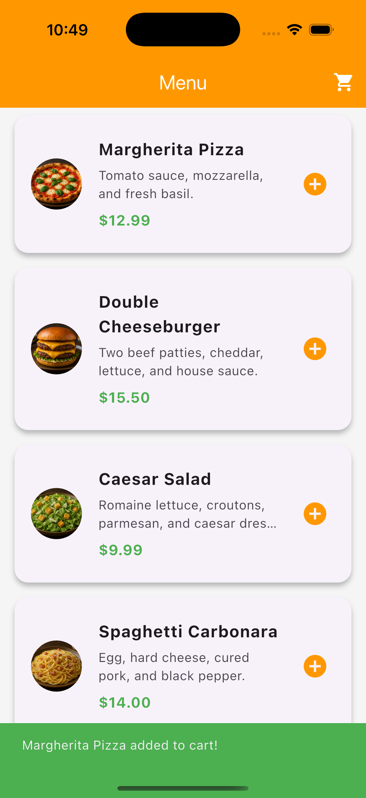

# Restaurant Menu (Flutter)

A scrollable digital menu application that simulates a food ordering experience. This project moves beyond static layouts to teach **Dynamic Lists**, showing you how to render data arrays efficiently using the builder pattern.

  

## 🎯 Learning Outcomes
By building this project, you will learn:
- **ListView.builder:** How to render potentially infinite lists efficiently (only drawing what is on screen).
- **Data Models:** Creating custom Dart classes (`FoodItem`) to structure your application data.
- **ListTile:** Using the standard Flutter widget for rows with images, titles, and trailing icons.
- **SnackBar:** Displaying temporary popup messages when the user interacts with an item.

## 📱 Features
- **Scrollable Feed:** A smooth list of food items with images and prices.
- **Data Driven:** The UI is generated entirely from a Dart list, not hardcoded widgets.
- **Interaction:** Tapping the "Add" button triggers a confirmation popup.
- **Currency Formatting:** Handling decimal prices (e.g., `$12.99`) properly.

## 🚀 How to Run

1. **Ensure you are in the project directory:**
    
    `cd flutter_restaurant_menu`
    
2. **Install Dependencies:**
    
    `flutter pub get`
    
3. **Run the App:**
    
    `flutter run`

## 🔙 Back to Main Repo

Find more projects and the full learning roadmap here:
[Flutter Example Apps](https://github.com/thaisangdang/flutter_example_apps)

## 📘 Want to Build Bigger Apps?

This project is just the beginning. If you want to learn how to architect production-ready applications with scalable code, check out my premium guide:

👉 [**Master Flutter Architecture - Build a Production-Ready Social App from Scratch**](https://thaisang.gumroad.com/l/flutter-architecture-build-a-social-app)

## ☕ Support My Work

If you found this project helpful, consider [buying me a coffee](https://buymeacoffee.com/thaisangdang) to keep my work coming!